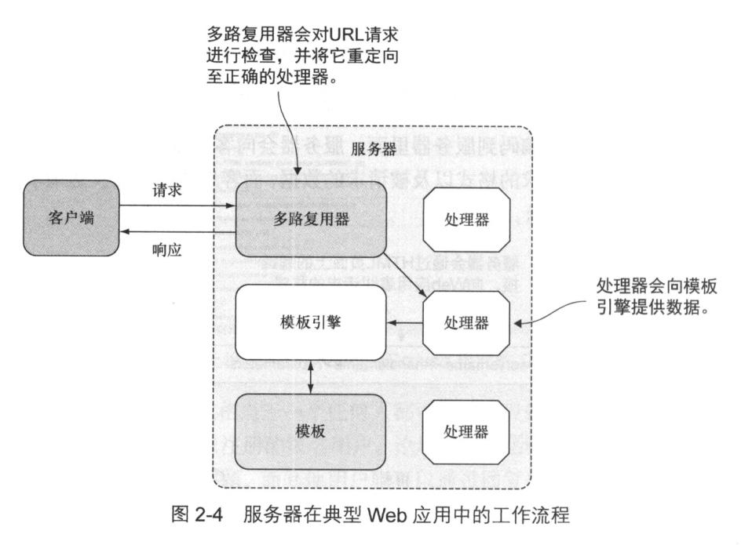

# 服务器在典型web应用中的工作流程
## 图解

## 具体
1. 客户端将请求发送到服务端一个URL上
2. 服务器的**多路复用器**按接收到的请求重定向到正确的处理器,由该处理器对请求进行处理。
3. 处理器处理请求执行必要动作。
4. 处理器调用模板引擎，生成相应HTML并返回给客户端。 

## 请求接收和处理
### 多路复用器
1. 多路复用器通过  
`mux := http.NewServeMux()`创建。
2. 将发送至根的URL请求重定向到处理器  
`mux.HandleFunc("/", index)`
### 服务静态文件
- 多路复用器还要为静态文件提供服务。
### 创建处理器函数

### 使用cookie进行访问控制
- 当一个用户登陆成功，服务器必须在后续请求中标注这是已登陆用户。
- 所以，服务器在响应的首部写入一个cookie,客户端收到cookie会存储在浏览器中。
- 验证用户身份时，
	1. 必须确保用户是真实存在。
  2. 提交给处理器的密码在加密后跟存储在数据库里已加密的密码一致。
- 核实之后
	1. 程序会使用User结构的CreatSession方法创建一个Session结构。
	2. 创建cookie结构
- 在处理器函数里检查当前访问用户是否登陆
  1. 创建session的工具函数，在各个处理器函数里复用。

## 使用模板生成HTML响应
1. 函数吧每个需要用到的模板文件放到GO切片里。
2. 切片指定的3个HTML文件都包含了特定的动作（嵌入命令）。动作会被`{{}}`包围。
3. 程序调用ParseFiles函数对模板文件进行语法分析，创建出相应模板，

